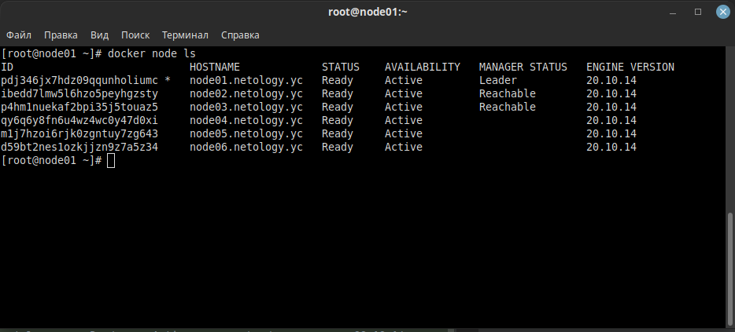
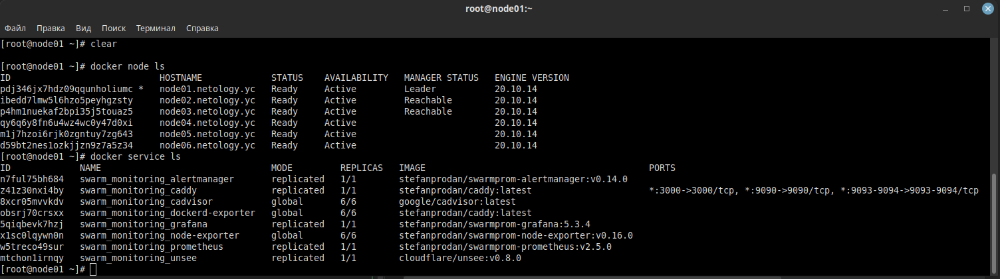

# Домашнее задание к занятию "5.5. Оркестрация кластером Docker контейнеров на примере Docker Swarm"

## Задача 1

Дайте письменые ответы на следующие вопросы:

- В чём отличие режимов работы сервисов в Docker Swarm кластере: replication и global? 
  - Global запускает докер образы на всех рабочих нодах, а replication только на том количестве которое указано в команде запуска.
- Какой алгоритм выбора лидера используется в Docker Swarm кластере?
  - Использует алгоритм Raft. Если обычный узел долго не получает сообщений от лидера, то он переходит в состояние «кандидат» и посылает другим узлам запрос на голосование. Другие узлы голосуют за того кандидата, от которого они получили первый запрос. Если кандидат получает сообщение от лидера, то он снимает свою кандидатуру и возвращается в обычное состояние. Если кандидат получает большинство голосов, то он становится лидером. Если же он не получил большинства (это случай, когда на кластере возникли сразу несколько кандидатов и голоса разделились), то кандидат ждёт случайное время и инициирует новую процедуру голосования.

Процедура голосования повторяется, пока не будет выбран лидер. 
- Что такое Overlay Network?
  - это логическая сеть создоваемая поверх другой сети.

## Задача 2

Создать ваш первый Docker Swarm кластер в Яндекс.Облаке

Для получения зачета, вам необходимо предоставить скриншот из терминала (консоли), с выводом команды:
```
docker node ls
```

```shell
[sergej@surg-adm ~]$ ssh centos@51.250.80.111
[centos@node01 ~]$ sudo -i
[root@node01 ~]# docker node ls
ID                            HOSTNAME             STATUS    AVAILABILITY   MANAGER STATUS   ENGINE VERSION
pdj346jx7hdz09qqunholiumc *   node01.netology.yc   Ready     Active         Leader           20.10.14
ibedd7lmw5l6hzo5peyhgzsty     node02.netology.yc   Ready     Active         Reachable        20.10.14
p4hm1nuekaf2bpi35j5touaz5     node03.netology.yc   Ready     Active         Reachable        20.10.14
qy6q6y8fn6u4wz4wc0y47d0xi     node04.netology.yc   Ready     Active                          20.10.14
m1j7hzoi6rjk0zgntuy7zg643     node05.netology.yc   Ready     Active                          20.10.14
d59bt2nes1ozkjjzn9z7a5z34     node06.netology.yc   Ready     Active                          20.10.14
[root@node01 ~]# 
```
<p align="center">
  
</p>
## Задача 3

Создать ваш первый, готовый к боевой эксплуатации кластер мониторинга, состоящий из стека микросервисов.

Для получения зачета, вам необходимо предоставить скриншот из терминала (консоли), с выводом команды:
```
docker service ls
```

```shell
[root@node01 ~]# docker service ls
ID             NAME                                MODE         REPLICAS   IMAGE                                          PORTS
n7ful75bh684   swarm_monitoring_alertmanager       replicated   1/1        stefanprodan/swarmprom-alertmanager:v0.14.0    
z41z30nxi4by   swarm_monitoring_caddy              replicated   1/1        stefanprodan/caddy:latest                      *:3000->3000/tcp, *:9090->9090/tcp, *:9093-9094->9093-9094/tcp
8xcr05mvvkdv   swarm_monitoring_cadvisor           global       6/6        google/cadvisor:latest                         
obsrj70crsxx   swarm_monitoring_dockerd-exporter   global       6/6        stefanprodan/caddy:latest                      
5qiqbevk7hzj   swarm_monitoring_grafana            replicated   1/1        stefanprodan/swarmprom-grafana:5.3.4           
x1sc0lqywn0n   swarm_monitoring_node-exporter      global       6/6        stefanprodan/swarmprom-node-exporter:v0.16.0   
w5treco49sur   swarm_monitoring_prometheus         replicated   1/1        stefanprodan/swarmprom-prometheus:v2.5.0       
mtchon1irnqy   swarm_monitoring_unsee              replicated   1/1        cloudflare/unsee:v0.8.0                        
[root@node01 ~]# 
```
<p align="center">
  
</p>

## Задача 4 (*)

Выполнить на лидере Docker Swarm кластера команду (указанную ниже) и дать письменное описание её функционала, что она делает и зачем она нужна:
```
# см.документацию: https://docs.docker.com/engine/swarm/swarm_manager_locking/
docker swarm update --autolock=true
```
Эта комманда выполняет включение шифрования логов Raft с созданием ключа шифрования.

