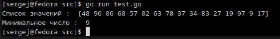

# Домашнее задание к занятию "7.5. Основы golang"
## Задача 1. Установите golang.
1. Воспользуйтесь инструкций с официального сайта: [https://golang.org/](https://golang.org/).
2. Так же для тестирования кода можно использовать песочницу: [https://play.golang.org/](https://play.golang.org/).

```shell
[sergej@fedora Загрузки]$ sudo tar -C /usr/local -xzf go1.18.3.linux-amd64.tar.gz
[sergej@fedora Загрузки]$ export PATH=$PATH:/usr/local/go/bin
[sergej@fedora Загрузки]$ go version
go version go1.18.3 linux/amd64
[sergej@fedora Загрузки]$
```

## Задача 2. Знакомство с gotour.
У Golang есть обучающая интерактивная консоль [https://tour.golang.org/](https://tour.golang.org/).
Рекомендуется изучить максимальное количество примеров. В консоли уже написан необходимый код,
осталось только с ним ознакомиться и поэкспериментировать как написано в инструкции в левой части экрана.  

> Ознакомился

## Задача 3. Написание кода.
Цель этого задания закрепить знания о базовом синтаксисе языка. Можно использовать редактор кода
на своем компьютере, либо использовать песочницу: [https://play.golang.org/](https://play.golang.org/).

1. Напишите программу для перевода метров в футы (1 фут = 0.3048 метр). Можно запросить исходные данные
у пользователя, а можно статически задать в коде.
    Для взаимодействия с пользователем можно использовать функцию `Scanf`:
    ```
    package main

    import "fmt"

    func main() {
        fmt.Print("Enter a number: ")
        var input float64
        fmt.Scanf("%f", &input)

        output := input * 2

        fmt.Println(output)    
    }
    ```

    ```go
    package main

    import "fmt"

    func main() {
        fmt.Print("Enter a number: ")
        var input float64
        fmt.Scanf("%f", &input)

        output := input / 3.28

        fmt.Println(output)    
    }
    ```
    <p align="center">
      
    </p>

1. Напишите программу, которая найдет наименьший элемент в любом заданном списке, например:
    ```
    x := []int{48,96,86,68,57,82,63,70,37,34,83,27,19,97,9,17,}
    ```

```go
package main

import "fmt"

func main() {
	x := []int{48, 96, 86, 68, 57, 82, 63, 70, 37, 34, 83, 27, 19, 97, 9, 17}
	n := 0
	fmt.Println("Список значений : ", x)
	for i, v := range x {
		if i == 0 {
			n = v
		} else {
			if v < n {
				n = v
			}
		}
	}
	fmt.Println("Минимальное число : ", n)
}
```
<p align="center">
  
</p>


1. Напишите программу, которая выводит числа от 1 до 100, которые делятся на 3. То есть `(3, 6, 9, …)`.

```go
package main

import "fmt"

func main() {
	var n int
	var m int
	n = 1
	m = 100

	for i := n; i <= m; i++ {
		if i%3 == 0 {
			fmt.Print(i, " ")
		}
	}
}
```
<p align="center">
  
</p>

## Задача 4. Протестировать код (не обязательно).

Создайте тесты для функций из предыдущего задания.
